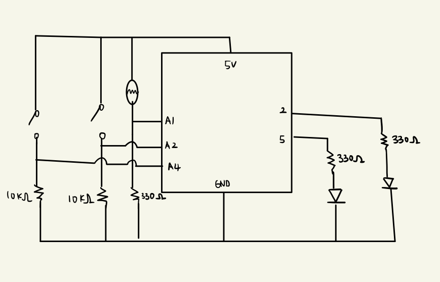
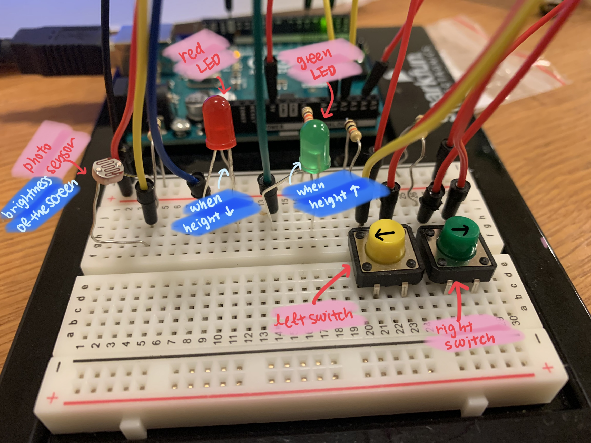
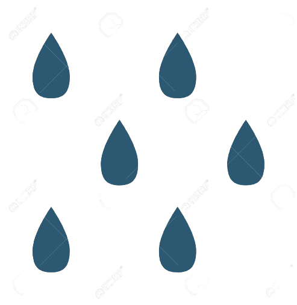
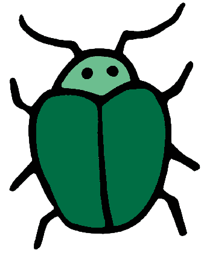
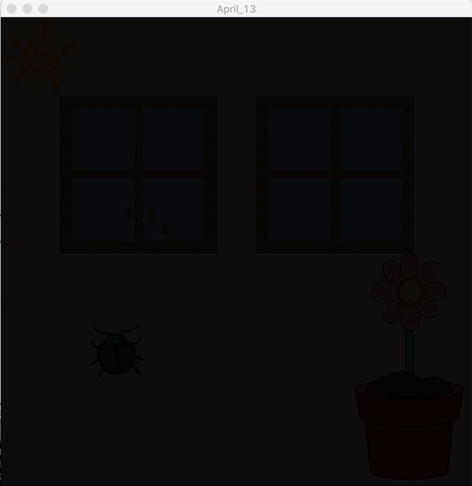
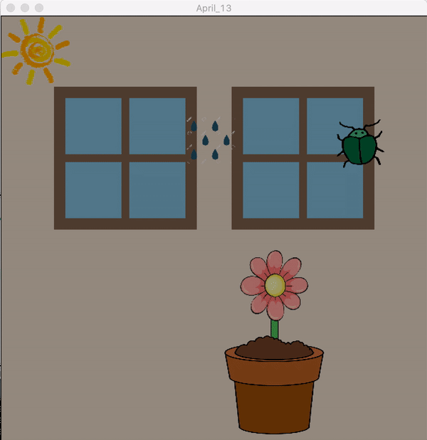
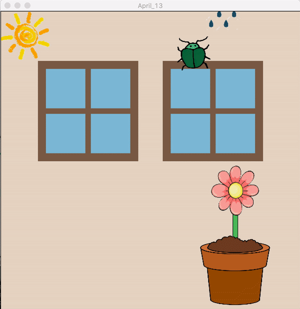

# Arduino Assignment 4: Grow Your Plant

This is a game where you can push switches on the arduino to control the movement of the pot to catch raindrops or an insect.

If the flower catches raindrops, the flower will grow and the green light will turn on. 
If the flower encounters an insect, the height of the flower will decrease and the red light will turn on.

THe brightness of the flower will be determined by the photosensor of the arduino board. The brighter light the sensor captures, the brighter the screen will be.

* If the height of the flower becomes negligible, you die!*
* If the height of the flower is over 200, you win!*

The link to the video of this work:

Materials Used:<br>
2 Switches<br>
2 LEDs<br>
1 Photosensor<br>

### Schematic
<p align="center">
  This is how my scheme looks like: <br>
  <br>
</p>

### Circuit
<p align="center">
  This is how my board looks like: <br>
  <br>
  This is my board with more explanations on how each part functions: <br>
  <br>
  1. Left/Right Switches<br>
  2. Green Led: When the flower gets raindrops, the height increases and green is turned on.<br> Red Led: When the flower gets the insect, the height decreased and red is turned on.<br>
  3. Photosensor: control the brightess of the screen<br>
</p>

### Process
1. I first started looking for images that I can use for this game.
<p align="center">
  
  
  
  
  
</p>

2.  With the basic concept in mind, I started working on the codes.

### Code
1. I first start working on the processing to make basic classes and functions. I built classes for the plant, food(raindrops or an insect), and the sun. Each class has the functions for displaying the image and updating its movments. For the functions that don't belong to the classes, there are bg() which draws windows in the background.

2. I built a function under the class for the food to check for collisions.
```
void update() {
    if (y_pos+delta_y>=h-grow-50) { //if the food collided with the flower, call check function

      if (x>flower_x && x<flower_x+100) {
        delta_y=-80;
        x=int(random(100, 500));
        check();
      }
    }
  }
  void check() { //make the height adjustments based on the type of the food
    if (index==0) {
      grow-=10;
      onOff=true; //set the variable for the switch
      time=millis(); //store the current time (later used to turn off the switch)
    };
    if (index==1) {
      grow+=10;
      onOff2=true;
      time=millis();
    };
    if (100+grow<10) { //if the height is less than 10, a player loses
      game=false;
      win=0;
    };
    if (100+grow>200) { //if the height is greater than 200, a player wins
      game=false;
      win=1;
    };
    collision=false; 
  }
```
3. In the draw() function, the functions are keep being called for updates.
```
  void draw() {
  background(235, 222, 207); //reset background
  bg();
  sun.display(); //display classes and update the movements
  main.update();
  main.display();
  bug.display();
  bug.update();
  raindrop.display();
  raindrop.update();
  if (game==false) { //if game is ended, display texts
    if (win==0) {
      textSize(60);
      fill(0, 0, 0);
      text("LOSE", 10, 60);
    } else {
      textSize(60);
      fill(0, 0, 0);
      text("WIN", 10, 60);
    }
    noLoop(); //stop the game
  }
};
```
4. Now the board is connected to the circuit. In the arduino, I wrote code that can read the written Serial from the processing to turn on/off the LED lights. Also, codes to read values from a photosensor and two switches were written.
```
void loop() {
  // put your main code here, to run repeatedly:
    while (Serial.available()) { //when there is something written in the port
    lose = Serial.parseInt();
    gain = Serial.parseInt();
    if (Serial.read() == '\n') { //read what's written
      digitalWrite(2, gain); //turn on or off LED lights based on the info read
      digitalWrite(5, lose);
      int sensor = analogRead(A1); //get values from sensors and switches
      delay(1);
      int left = digitalRead(A2);
      delay(1);
      int right = digitalRead(A4);
      delay(1);
      Serial.print(sensor); //write values from sensors on the port
      Serial.print(',');
      Serial.print(left);
      Serial.print(',');
      Serial.println(right);
    }
  }
}
```

5. In the processing, the values from the sensors were read from the port and control the movement of the flower and the brightness of the screen.
```
void serialEvent(Serial myPort) {
  String s=myPort.readStringUntil('\n'); //read the string from the port
  s=trim(s);
  if (s!=null) {
    println(s);
    int values[]=int(split(s, ','));
    if (values.length==3) {
      light=(int)map(values[0], 0, 1023, 255, 0); //from the photosensor
      left=values[1]; //from switch (left)
      right=values[2];//from switch (right)
    }
  }
  myPort.write(int(onOff)+","+int(onOff2)+"\n"); //give info about controlling LED lights to the board
}
```
### How It Looks Like
<p align="center">
  When the brightness of the screen changes depending the light captured by the photosensor <br><br>
  <br>
</p>
<p align="center">
  When the flower captures raindrops, the height increases <br><br>
  <br>
</p>
<p align="center">
  When the flower captures the insect, the height decreases <br><br>
  <br>
</p>

### Challenges
It was a bit hard for me to recall the things that I used for Processing, so I spent some time trying to remembering how I used Processing. Since I wanted to make my codes look organized, I put some effort in trying to restructure my codes and rearrange them. 

For the coding part, I fo found it relatively easy to build the game and to get the values from the sensor and using it for the Processing project.
