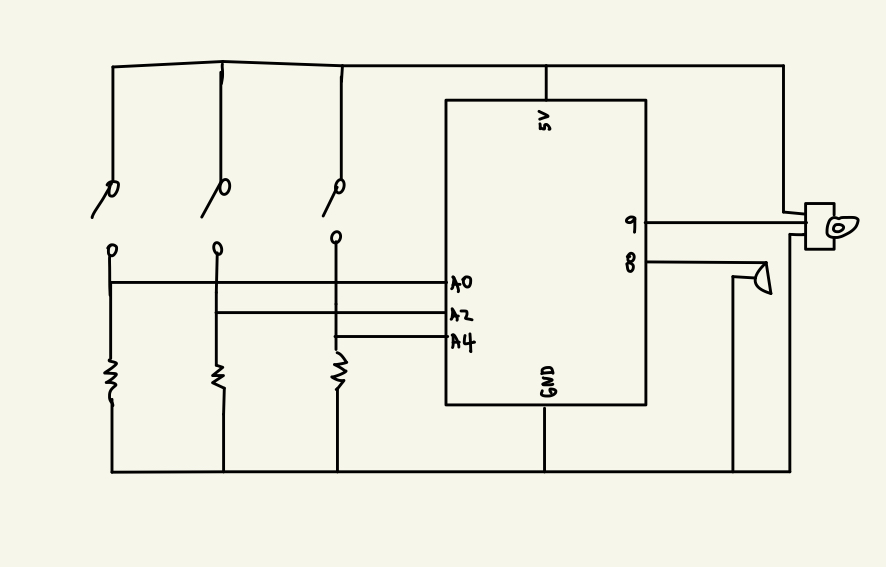
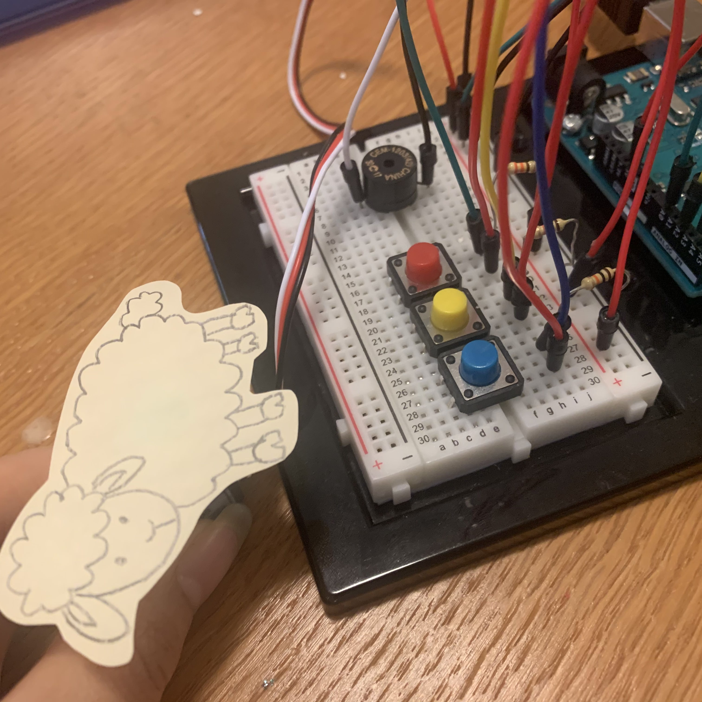
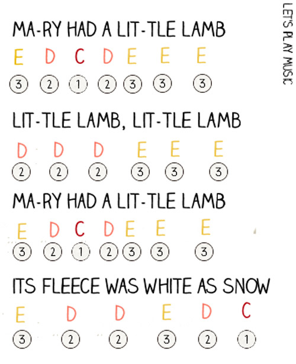

# Arduino Assignment 3: Musical Instrument - Mini Piano

I made a mini piano with a buzzer and switches. There are three switches, each of which plays C or D or E note. <br>
If you start the program, the melody for "Mary Little Lamb" will be played, the song you can play with the three notes that switches play through the buzzer. While you push the switch to make a sound, the lamb (attached to the servo motor) will make moves. <br>

The link to the video of this work: https://youtu.be/SLZtUJMa43A

Materials Used:<br>
3 Switches<br>
1 Buzzer<br>
1 Servo Motor<br>

### Schematic
<p align="center">
  This is how my scheme looks like: <br>
  <br>
</p>

### Circuit
<p align="center">
  This is how my board looks like: <br>
  <br>
</p>

### Process
I tried to make a piano and the simple song I came up with is "Mary Little Lamb." I chose this song as only three notes are needed to play this song and it is a famous children song.

1. I found the piano sheet for the song. <br>
  <p align="center">
  <br>
  The note is from here: https://www.letsplaykidsmusic.com/mary-had-a-little-lamb-easy-piano-music/ <br>
  </p>
    
2. I drew the lamb that would be attached to the servo motor.
  <p align="center">
    <br>
  </p>
3. I drew the circuit and built the board.

### Code
1. I first defined frequency of three notes I will use to play the melody and made a seperate file including them.
```
#define NOTE_C 261
#define NOTE_D 294
#define NOTE_E 329
```

2. I created a list of melody and rhythms to play the melody when the program is started. And the melody is playe using for loop in the function setup(). Also in setup(), I set switches as input.
```
int melody[] = {
  NOTE_E, NOTE_D, NOTE_C, NOTE_D, NOTE_E, NOTE_E, NOTE_E, NOTE_D, NOTE_D, NOTE_D, NOTE_E, NOTE_E, NOTE_E,
  NOTE_E, NOTE_D, NOTE_C, NOTE_D, NOTE_E, NOTE_E, NOTE_E, NOTE_D, NOTE_D, NOTE_E, NOTE_D, NOTE_C
};

int rhythm[] = {
  10, 6, 8, 8, 8, 8, 4, 8, 8, 4, 8, 8, 4,
  10, 6, 8, 8, 8, 8, 4, 8, 8, 10, 6, 2
};

void setup(){
  for (int thisNote = 0; thisNote < 25; thisNote++) {
      int rhythmDuration = 1000 / rhythm[thisNote];
      tone(8, melody[thisNote], rhythmDuration);
      int pauseBetweenNotes = rhythmDuration * 2.00;
      delay(pauseBetweenNotes);
      noTone(8);
    }    
  pinMode(INPUT, C);
  pinMode(INPUT, D);
  pinMode(INPUT, E);
}
```
3. digitalRead() is used to find out which switches are pushed the following note is played by the buzzer.
```
  int C_read = digitalRead(C);
  int D_read = digitalRead(D);
  int E_read = digitalRead(E);

  if (C_read == HIGH) {
    tone(8, NOTE_C, 1000 / 8);
  }
  if (D_read == HIGH) {
    tone(8, NOTE_D, 1000 / 8);
  }
  if (E_read == HIGH) {
    tone(8, NOTE_E, 1000 / 8);
  }
```
4. If one of any switches were pushed, servo motor will make a movement to move the lamb.
```
 if (E_read == HIGH || D_read == HIGH || C_read == HIGH) {
    for (pos = 0; pos <= 180; pos += 1) {
      myservo.write(pos);
    }
    for (pos = 180; pos >= 0; pos -= 1) {
      myservo.write(pos);
    }
```

### Difficulties
There was some weird sound played after the melody is played for once in the setup() and the switch wouldn't work. I found out that this is the problem of for loop. I set the condition longer that it should have been; after correcting the condition for for loop, the weird sound wasn't there any more.

It is still kind of confusing to manipulate the moves of a servo motor accurately. I think I need more practice on that part.
