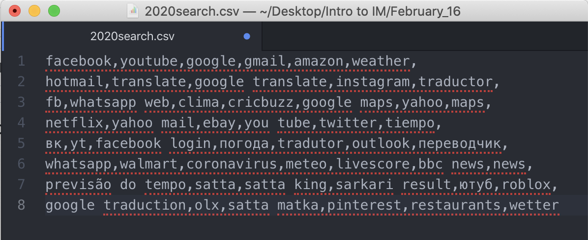

# Top 50 Google Searches in 2020
I created a little animation where the 50 keywords that were searched the most on Google in 2020. The most searched word appears first with the biggest size and greatest opacity. As its rank goes down, the size of the text and opacity decreases. 

The top 50 Google searches were found here:
https://www.semrush.com/blog/most-searched-keywords-google/#header3

I expected to have a lot of keywords related to pandemic and Covid-19. However, most words were the name of social media, weather, and translators in English, Spanish, and Russian. For me, at least, the top 50 searches in 2020 were quite surprising.

#### Process & Code ####
* I first made a csv file of top 50 Google searches in 2020. The keywords are separated by ",".
<p align="center">
  
</p>

* Then I started to work on coding part in Processing. I first loaded the text from a csv file and split the text by ",". The keywords were then stored in an array of strings.
```
String strings[]; //array for loading csv file
String data[]; //store data of texts

void loaddata() { //function to load csv file
  strings = loadStrings("2020search.csv");
  data= split(strings[0], ","); //split text into ","
};
```

* After loading the text, I created another function to display the text. Here, I set the font as "DejaVuSans-BoldOblique". The color was chosen randomly, and the size of text keeps decreasing as the rank for keywords goes down.

```
void display() { //function for display
  int r=int(random(0, 192));  //choose random colors
  int g=int(random(0, 192));
  int b=int(random(0, 192));

  PFont f = createFont("DejaVuSans-BoldOblique", 32); //create fonts
  textFont(f, fontsize);
  color textcolor = color(r, g, b, opacity); //create color
  fill(textcolor);  
  
  if (index==0) { //set text align
    textAlign(CENTER);
  } else {
    textAlign(LEFT);
  }
  text(data[index], x, y); //write text on the screen
};
```
* In the setup(), frameRate was set as 3.

* By calling these two function inside the draw(), the 50 keywords were displayed. In the draw(), the index for keywords, the x and y position of texts, fontsize, and opacity were controlled.

```
void draw() {
  loaddata(); //call function
  if (index<50) { //there are only 50 words in csv file
    display(); //display text
    index++; //increase index
    fontsize-=1; //control variables for fontsize, opacity
    opacity-=5;
    if (index%2==0) { //control x and y coordinates of text, so that it doesn't go out of the window.
      x+=int(random(50, 500));
    } else {
      x-=int(random(50, 300));
    }
    if (x<0){x+=200;}
    if (x>600) {x-=100;}
    y+=50;
    if (y>=800){
      y=400;
    };
  };
};
```

#### Difficulties ####
* I had hardships where to put the lines for resetting the background. Based on its location, the result was very different. Someimtes it showed only one food among 7 of them, and sometimes the trace of food was visible in the window.
* When using different conditions, the syntax if very important. WHen the lines that should be under the if condition are not in the bracket, it will lead to a disaster, which may take you a long time to figure out what's wrong.
* I tried to use the loadFont() function, but I couldn't figure out how it works. Does Processing only support certain types of font file?

#### What I enjoyed creating this ####
I used the keyPressed() and keyReleased() function to move the character and I really like the result of how it moves! I love how draw() function can make many more sophisticated animation possible.

#### What I couldn't finish ####
I wanted to make a pot or circle that shows the score dynamically by showing how full is the pot. However, there was no enough time to realize this part. I also want to make the food falling animation more sophisticated. Now, the food may have same x coordinates and collide to each other. However, I wanted to avoid this as well.

#### Result ####
1st trial:<br>
<p align="center">

</p>

2nd trial:<br>
<p align="center">

</p>


