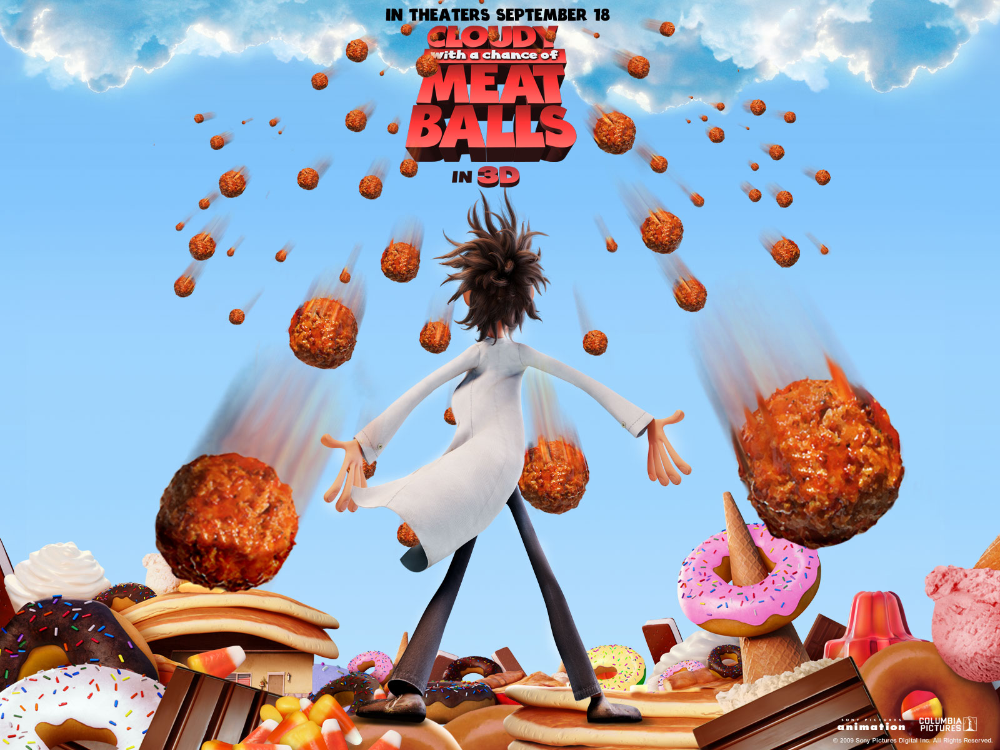

# Food Falling from the Sky
I created a little game where the main character eats food falling from the sky. I got this idea from the movie "Cloudy with a Chance of Meatball," which I enjoyed watching in my childhood. I added my personal taste of food and changed some elements that come out in the movie. I miss Korean food a lot these days, and since lunar new year is this friday, I decided to choose Korean food and a character wearing Hanbok, Korean traditional clothes. 

  Poster of "Cloudy with a Chance of Meatball":  
  

#### Process ####
* I first drew the background with my ipad. I tried to describe sky, trees, and the ground by using various watercolors. I felt that this can give more simplicity in the background than drawing the actual elements.

  

* Then I constructed a class for food and made an array of classes for food. I collected the image for korean food and then processed to remove the background and set the pixel size. The class for food has various functions including display(), move(), eatFood(), collision(), and etc.

  
  
  
  
  
  
  

* Then I constructed a class for the character. I collected the image for korean food and then processed to remove the background. The class for character has various functions including display(), move(), and etc.

  

#### Code ####
* I used object oriented programming(OOP) using two classes, one for main character and one for food, and functions.
* I used for loop to generate initializing instances for food.
* keyPressed() and keyReleased() functions are used to control the movement of the main character. She can move to left, right, and upward.

#### Difficulties ####
* I had hardships where to put the lines for resetting the background. Based on its location, the result was very different. Someimtes it showed only one food among 7 of them, and sometimes the trace of food was visible in the window.
* When using different conditions, the syntax if very important. WHen the lines that should be under the if condition are not in the bracket, it will lead to a disaster, which may take you a long time to figure out what's wrong.
* I tried to use the loadFont() function, but I couldn't figure out how it works. Does Processing only support certain types of font file?

#### What I enjoyed creating this ####
I used the keyPressed() and keyReleased() function to move the character and I really like the result of how it moves! I love how draw() function can make many more sophisticated animation possible.

#### What I couldn't finish ####
I wanted to make a pot or circle that shows the score dynamically by showing how full is the pot. However, there was no enough time to realize this part. I also want to make the food falling animation more sophisticated. Now, the food may have same x coordinates and collide to each other. However, I wanted to avoid this as well.

#### Result ####

