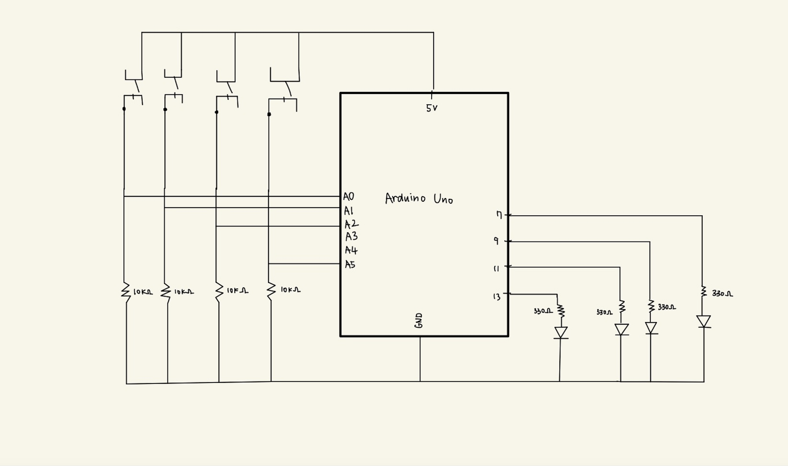
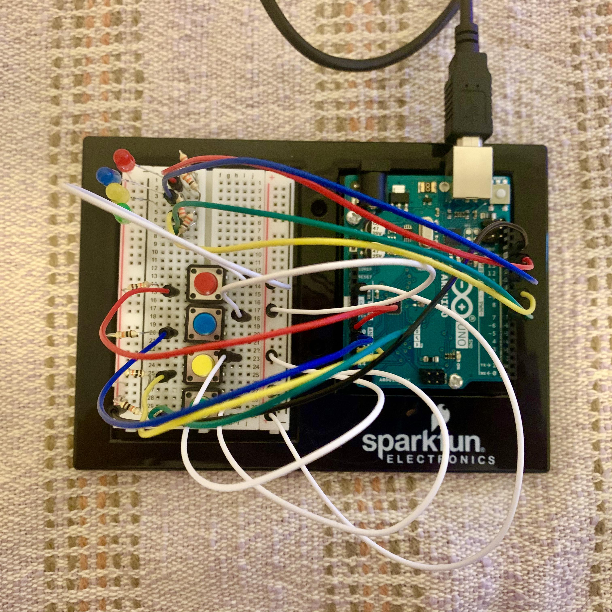
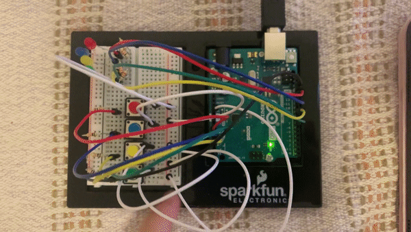
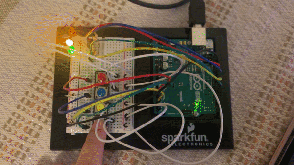
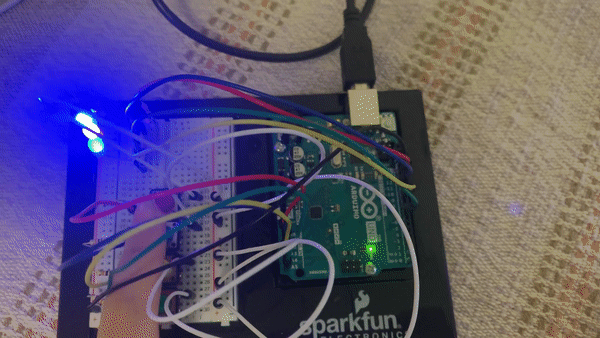
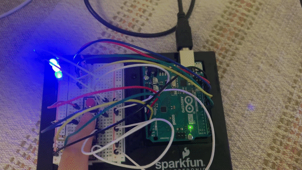

# Arduino Assignment 1: Puzzle with Momentary Switches and LEDs
Try pushing switches and turn all the lights on!

I used 4 led lights (red, blue, yellow, green) and 4 switches to make a puzzle.
To start the game, you can push any of switches.
Then the light will turn on in the way which users should try to achieve.
You will have a chance to push all switches to find out which led light it turns on.

HINT:
1. Which two colors mix up to make one color?
2. Use you chance to find out what color each switches light up and click according switches three times!

### Circuit
<p align="center">
  This is how my scheme looks like: <br>
  <br>
  This is how my board looks like: <br>
  <br>
</p>

### How to Play/Answers
1. You can start playing this game by pushing any of the switches. <br>Then it will turn on all the lights and off three times. It shows you need to aim for turning all the lights.<br>
  <p align="center">
  <br>
  </p>
2. Try pushing switches to find out which color of LED each switch turns on. <br>
  <p align="center">
  <br>
  </p>
3. As yellow and blue mix up to green, you need to push switches that turn on yellow and blue lights. <br>Push red and green switches consecutively!
  <p align="center">
  <br>
  </p>
4. After green turns on, try pushing switches to find out which color of LED each switch turns on. <br>
  <p align="center">
  <br>
  </p>
5. Whereas yellow and green turn on red and blue LED respectively, both red and blue switches turn on yellow LED. This gives a hint that yellow should be turned on next. <br>Try pushing switches that turn on yellow LED three times.
  <p align="center">
  <br>
  </p>
6. After yellow turns on, try pushing switches to find out which color of LED each switch turns on. <br>
  <p align="center">
  <br>
  </p>
7. Only the green switch turns on blue and all other switches turn on red. This time it implies that blue should be turned on next. <br>Try pushing the green switch for three times to turn on blue LED.
  <p align="center">
  <br>
  </p>
8. After blue turns on, try pushing switches to find out which color of LED each switch turns on. <br>
  <p align="center">
  <br>
  </p>
9. Blue and yellow switches turn on red LED whereas other two switches turn on no LED at all. It implies that red should be turned on next. <br> Try pushing switches that turn on red LED for three times.
  <p align="center">
  <br>
  </p>


### Code
I first made const int variables for following numbers for switches and LED lights.
```
const int r_led = 13; //variables for led lights
const int b_led = 11;
const int y_led = 9;
const int g_led = 7;

const int r_btn = A0; //variables for switches
const int b_btn = A1;
const int y_btn = A2;
const int g_btn = A5;
```

Since my game is to turn on all lights permanently, I also added boolean variables to check if each light is on.
```
boolean y_on = false; //check if each led light is turned on
boolean g_on = false;
boolean r_on = false;
boolean b_on = false;
```
In the loop(), I used a lot of if conditions to check if the switch was pushed and make the following responses by the LED lights.

### Difficulties
I was not really familiar with the whole concept of circuit and how to build it, so it took quite a bit of time to build the circuit with 4 switches and 4 LED lights.The wire part of resistor and LED lights are so sharp and I hurt my hands:( <br><br>

For the programming part, everything was pretty smooth except that there were new functions or methods I wasn't really familiar with.
The hardest part for programming was when turning on the green LED. Red and green switches should be pushed consecutively, regardless of order, so I had to calculate various cases and control them by giving them conditions.

```
if (g_chance_by_y == true) { //check if chances for a green light are on by a yellow light
      if (g_read == HIGH) { //if a blue lights is turned on (g_btn turns on blue)
        g_on = true; //turn on green (yellow + blue)
        digitalWrite(g_led, HIGH);
      }
      if (r_read == HIGH or b_read == HIGH or y_read == HIGH) { //if any other switches are pushed 
        g_chance_by_y = false; //chance is gone again
      }
    }
    if (g_chance_by_b == true) { //check if chances for a green light are on by a blue light
      if (r_read == HIGH) { //if a yellow light is turned on (r_btn turns on yellow)
        g_on = true; //turn on green (blue + yello)
        digitalWrite(g_led, HIGH);
      }
      if (g_read == HIGH or b_read == HIGH or y_read == HIGH) { //if any other switches are pushed
        g_chance_by_y = false; //chance is gone againe
      }
    }
```
