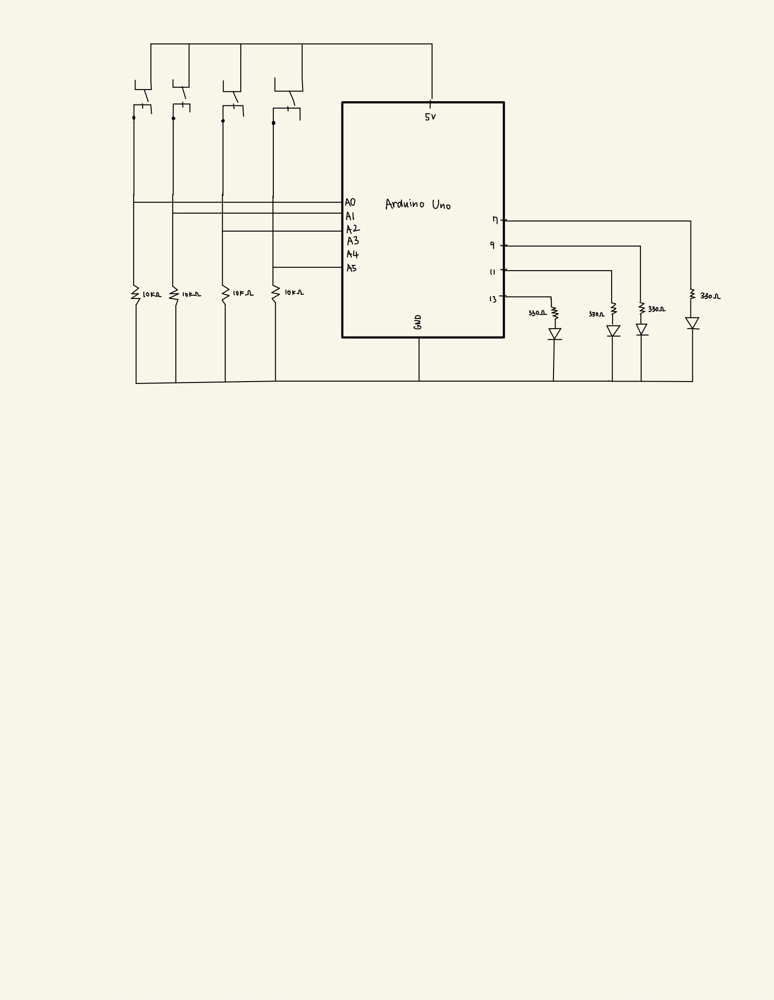

# Arduino Assignment 1: Puzzle with Momentary Switches and LEDs
Try pushing switches and turn all the lights on!

I used 4 led lights (red, blue, yellow, green) and 4 switches to make a puzzle.
To start the game, you can push any of switches.
Then the light will turn on in the way which users should try to achieve.
You will have a chance to push all switches to find out which led light it turns on.

HINT:
1. Which two colors mix up to make one color?
2. Use you chance to find out what color each switches light up and click according switches three times!

### Circuit

  This is how my scheme looks like:  
   
  This is how my board looks like:  
   

### Instruction
I created this game based on classic rules of the original game. But I added different types of moles, which will give you different score when hitting them. Also, if you hit the flower, you will lose 10 points.

Simply, you win by reaching 100 points. You lose if the score reaches -30!

  Below is the picture for detailed instruction:  
  

