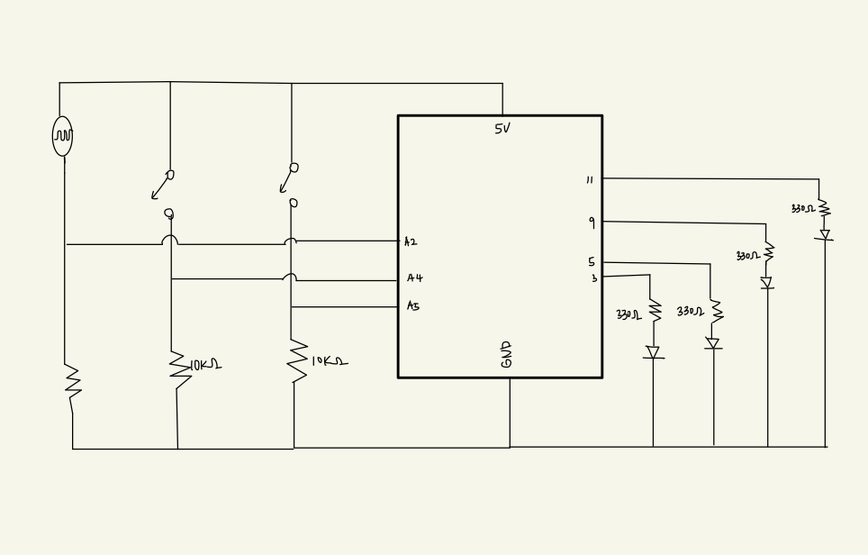
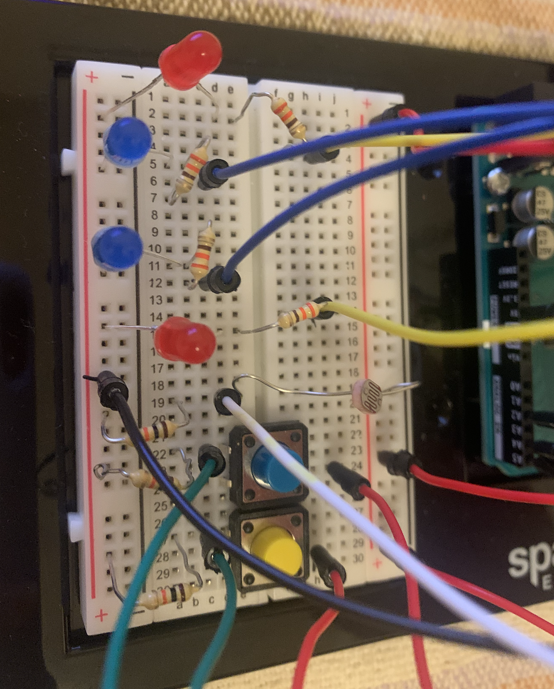

# Arduino Assignment 2: Blinks and Blushes

I wanted to express how our eyes and cheeks response under different intensity of light.

Based on the intensity of light the photosensor captures, the speed of the eye blinking motion and the redness of blush changes. The stronger lights will make eyes blink faster and stronger red the blush will be, as humans are under the strong lights.

As photosensor captures the stronger light, 
the eyes (blue lights) will blink faster and cheeks will get blush in a stronger red lights.

While you push the blue switch, 
the eye will be closed (blue lights) will be turned off and blushes will also get dimmer.

While you push the yellow switch, 
the eye will open up (blue lights) will be turned on strongly and blushes will also get stronger.

The link to the video of this work: https://youtu.be/C05GPAjhsCI

Materials Used:<br>
2 Blue LEDs<br>
2 Red LEDs<br>
2 Swithces<br>
Photosensor<br>

### Circuit
<p align="center">
  This is how my scheme looks like: <br>
  <br>
  This is how my board looks like: <br>
  <br>
</p>

### How to Play
1. As programs are uploaded, the eyes will blink and cheeks will show the red light with intensity corresponding to the environment.
  <p align="center">
  <br>
  </p>
2. If I cover the photosensor with my finger, the sensor detects the light of less intensity. The blinking motion will get slower and the blush will be dimmer. <br>
  <p align="center">
  <br>
  </p>
3. If the board is placed under the strong light, the blue lights will blink faster and cheeks will present a stronger red light. <br>
  <p align="center">
  <br>
  </p>
4. While blue switch is pushed, the eyes will be closed, expressed as blue lights being turned off. And cheeks will also get dimmer. <br>
  <p align="center">
  <br>
  </p>
5. While yellow switch is pushed, the eyes will be open, expressed as blue lights being turned on. And cheeks will also get brighter. <br>
  <p align="center">
  <br>
  </p>

### Code
I first made const int variables for following numbers for switches and LED lights.
```
const int led1 = 5; //variables for blue lights
const int led2 = 3;
const int LDRPIN = A2; //variable for photosensor
const int btn1 = A4; //variables for switches
const int btn2 = A5;
const int led3 = 11; //variables for red lights
const int led4 = 9;
```

The intensity of light from photosensor and the voltage from switch is read from following lines.
```
int sensorValue = analogRead(LDRPIN); //read from photosensor
int btnread1 = digitalRead(btn1); //read from switches
int btnread2 = digitalRead(btn2);
```
If the blue switch is pushed, the motions are controlled by following lines.
```
if (btnread1 == HIGH) { //if blue switch is pushed
    digitalWrite(led1, LOW); //turn off blue lights
    digitalWrite(led2, LOW);
    analogWrite(led3, 5); //make red lights dimmer
    analogWrite(led4, 5);
    delay(30);
}
```

If the yellow switch is pushed, the motions are controlled by following lines.
```
else if (btnread2 == HIGH) { //if yellow switch is pushed
    digitalWrite(led1, HIGH); //turn on red blue lights
    digitalWrite(led2, HIGH);
    analogWrite(led3, 255); //make red lights stronger
    analogWrite(led4, 255); 
    delay(30);
}
```
When no switch is being pushed, the motions are controlled by following lines.
```
else { //if no switch is pushed, blinking motion
    digitalWrite(led1, HIGH); //turn on
    digitalWrite(led2, HIGH);
    delay(v); //spped of delay is influenced by the intensity of light

    digitalWrite(led1, LOW); //turn off
    digitalWrite(led2, LOW);
    delay(v); //delay

    analogWrite(led3, brightness); //brightness of red lights is influenced by the intensity of light
    analogWrite(led4, brightness);
    delay(20);
}
```

### Difficulties
I wanted to make the motion more sophisticated with fading when the switch is pushed, but I think it is not possible to use one led as both digital and analog output. I tried to do that but it didn't work. 

I also wanted to get cheeks fading when the switch is pushed; however, the program is keep updating the value from the sensor. It was not easy to control the value from the sensor.

I wanted to make more drastic changes in the intensity of red light; however, the light could only range from 0 to 255.
