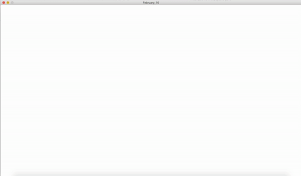

# Intro to Interactive Media

### Weekly Assignment ###
#### Week1-January 26: Self Portrait ####
In the self portrait, I wanted include some of my preferences. As my favorite flower is sunflower, I tried to draw it on the clothes. The colors were also chosen based on my love for pastel colors. I used pastel green color for the background and pastel blue for my clothes. I had the short hair for over 5 years now, so I also included that in the self-portrait. Moreover, although it is very trivial, I added some cheek blusher, which is my favorite make-up. Overall, in the portrait, I added things that I love the most. 
[*click to see more details*](https://github.com/nakyeongahn/IntrotoIM/blob/main/January_26/README.md)

#### Week2-February 2: A Growing Circle ####
The big pink circle follows your mouse while other little circles are randomly moving around the window. I added more vibrance by changing the color of small circles regularly. The main circle will get bigger when it collides with other small circles. Once the main circle reaches its maximum radius and gets bigger than the window, the motion will stop. 
[*click to see more details*](https://github.com/nakyeongahn/IntrotoIM/blob/main/February_2/README.md)

#### Week3-February 9: Food Falling from the Sky
I created a little game where the main character eats food falling from the sky. I got this idea from the movie "Cloudy with a Chance of Meatball," which I enjoyed watching in my childhood. I added my personal taste of food and changed some elements that come out in the movie. I miss Korean food a lot these days, and since lunar new year is this friday, I decided to choose Korean food and a character wearing Hanbok, Korean traditional clothes.  
[*click to see more details*](https://github.com/nakyeongahn/IntrotoIM/blob/main/February_9/README.md)

  

#### Week4-February 16: Top 50 Google Searches in 2020
I created a little animation where the 50 keywords that were searched the most on Google in 2020. The most searched word appears first with the biggest size and greatest opacity. As its rank goes down, the size of the text and opacity decreases. 

The top 50 Google searches were found here:
https://www.semrush.com/blog/most-searched-keywords-google/#header3

I expected to have a lot of keywords related to pandemic and Covid-19. However, most words were the name of social media, weather, and translators in English, Spanish, and Russian. For me, at least, the top 50 searches in 2020 were quite surprising. 
[*click to see more details*](https://github.com/nakyeongahn/IntrotoIM/blob/main/February_16/README.md)

  
  

