# Smart Broom
This RC car with a broom attached at the end will clean your place!

This program codes for a RC car which avoids obstacles automatically using an ultrasonic sensor.
Ultrasonic sensor detects obstacles from 40 to 140 (angle) and the rotation happen with the help of a servo motor.
Once it receives a signal from Processing program, the RC car starts moving as coded.
Along with its movements, the relevant information is being written on the port. This information is read from processing and displays how the car is moving and where the obstacles were detected. You can also control the movement of the car by pressing the pause button.

This is the link to the video: https://youtu.be/j66K3WvLUWU

### Motivation
I wanted to make a vehicle using motors as I enjoyed controlling the movment of the motor. Then, I suddenly remembered the robot vacuum cleaner in my home. My mom bought it several years ago but she hasn't really used it. She told me it is pretty uncomfortable as there is no way to see whether it is working properly remotely. So, I decided to make this RC car with a broom which can be controlled by the screen on laptop.  

### Model

  This is how I first designed the RC car:  
  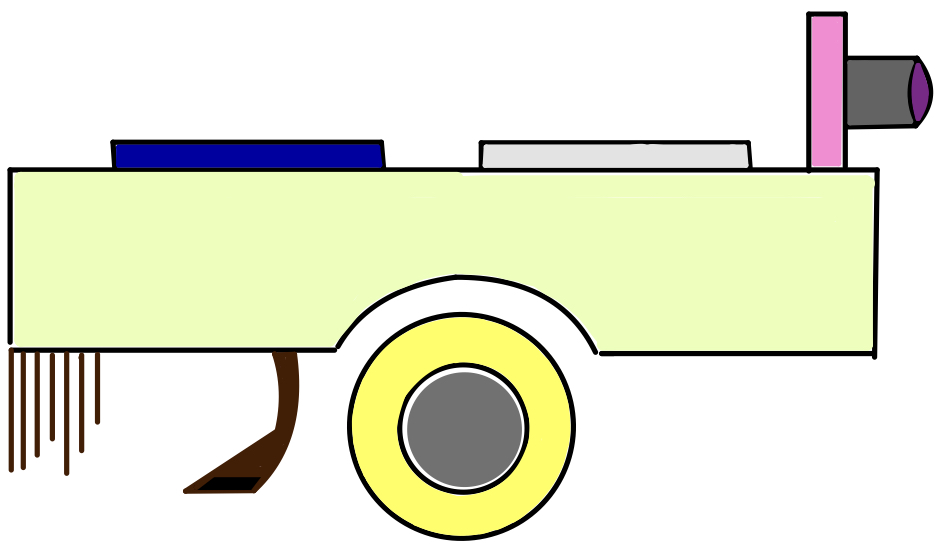

### Schematic

  This is the scheme of this device:  
  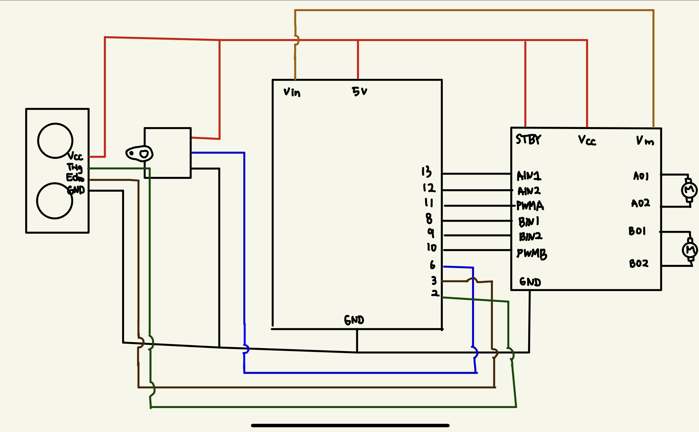

1. Ultransonic Sensor:   used to detect obstacles
2. Servo Motor:   responsible for rotating the ultrasonic sensor
3. DC motor:   responsible for wheels' movements

### Device
First, I made a normal RC car with an ultrasonic sensor and a servo motor. And I attached a small broom at the end. I had to cut some part off to adjust the size of the broom.

  This is how the broom looks like befor cutting some part off:  
  

  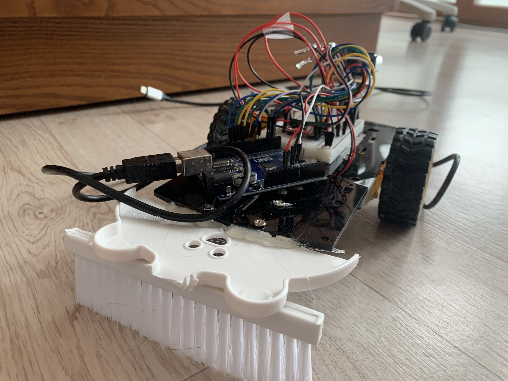

  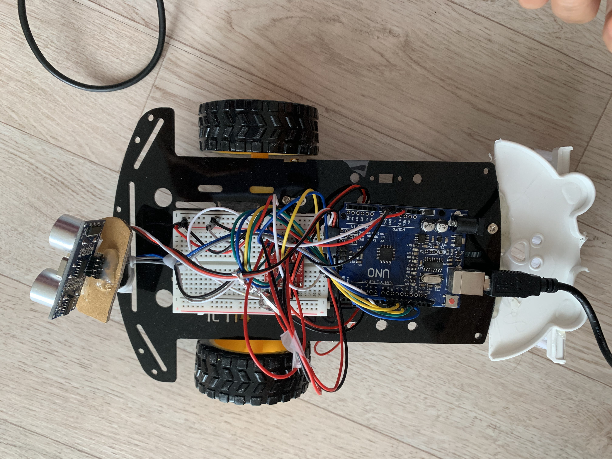

  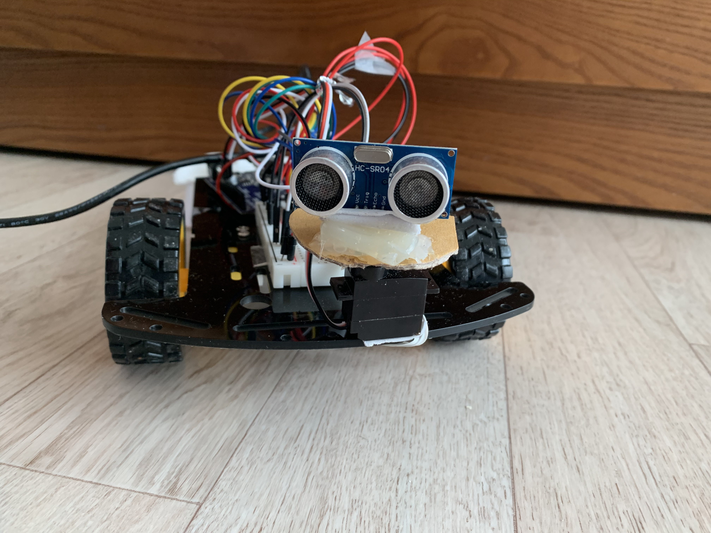

### How Does Arduino and Processing Interact / How It Works
1. After uploading .ino file to the Arduino board, play the processing file. Then the start screen will display. 

  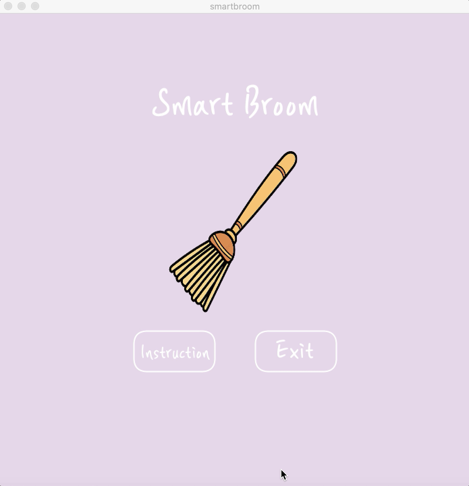

2. If you click the button "Instructions," the new screen will show you the components of the device.  
  

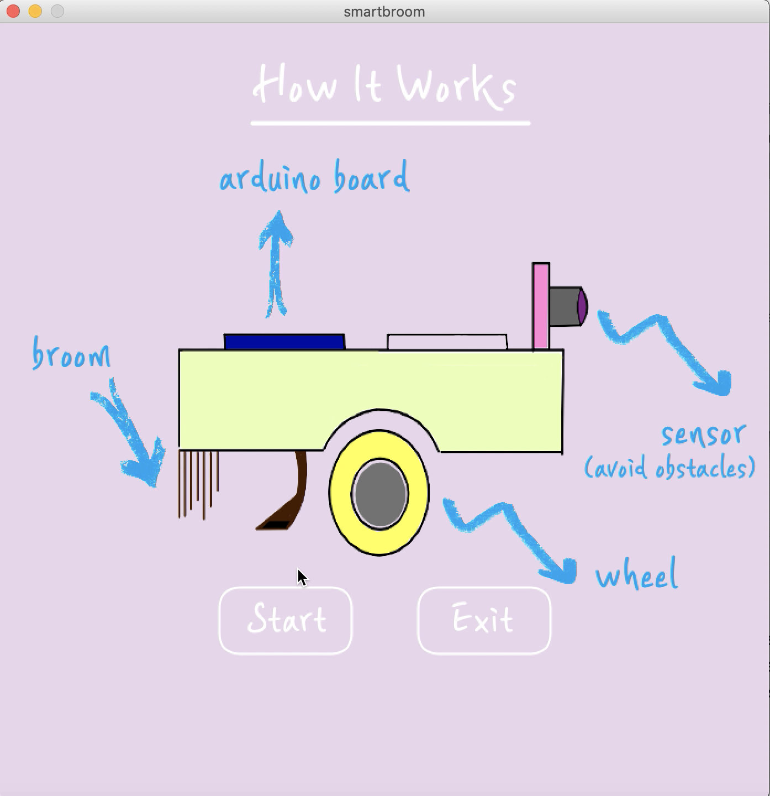

3. Click the start button, then the screen will change and also the device will start moving forward. If the ultrasonic sensor does not detect obstacle within 15 cm, the following screen will be shown.  

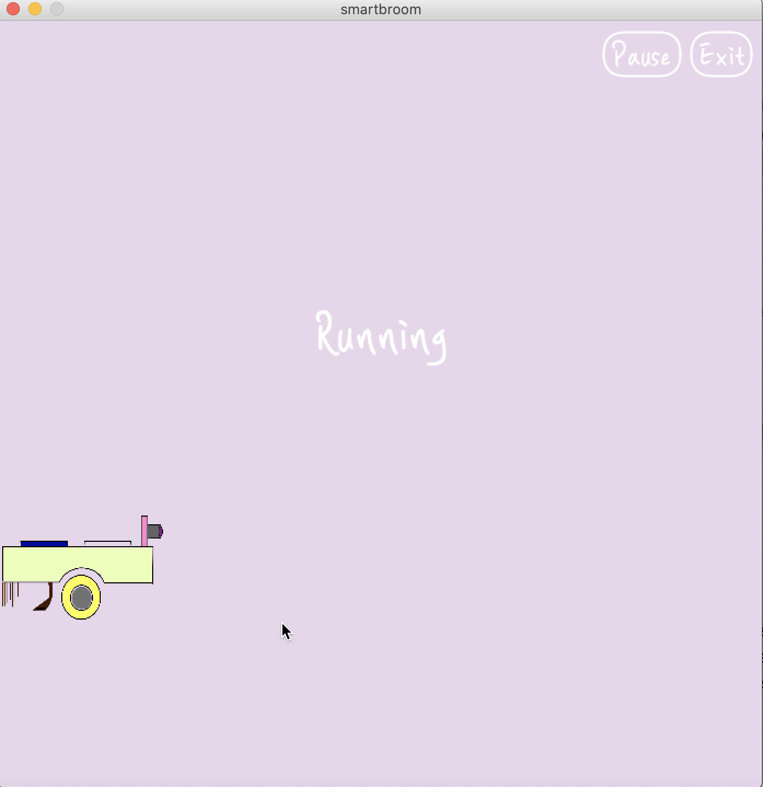

  
3. If the obstacle is detected from the left sight, the car will move backward and then turn right. The following screen will be shown.

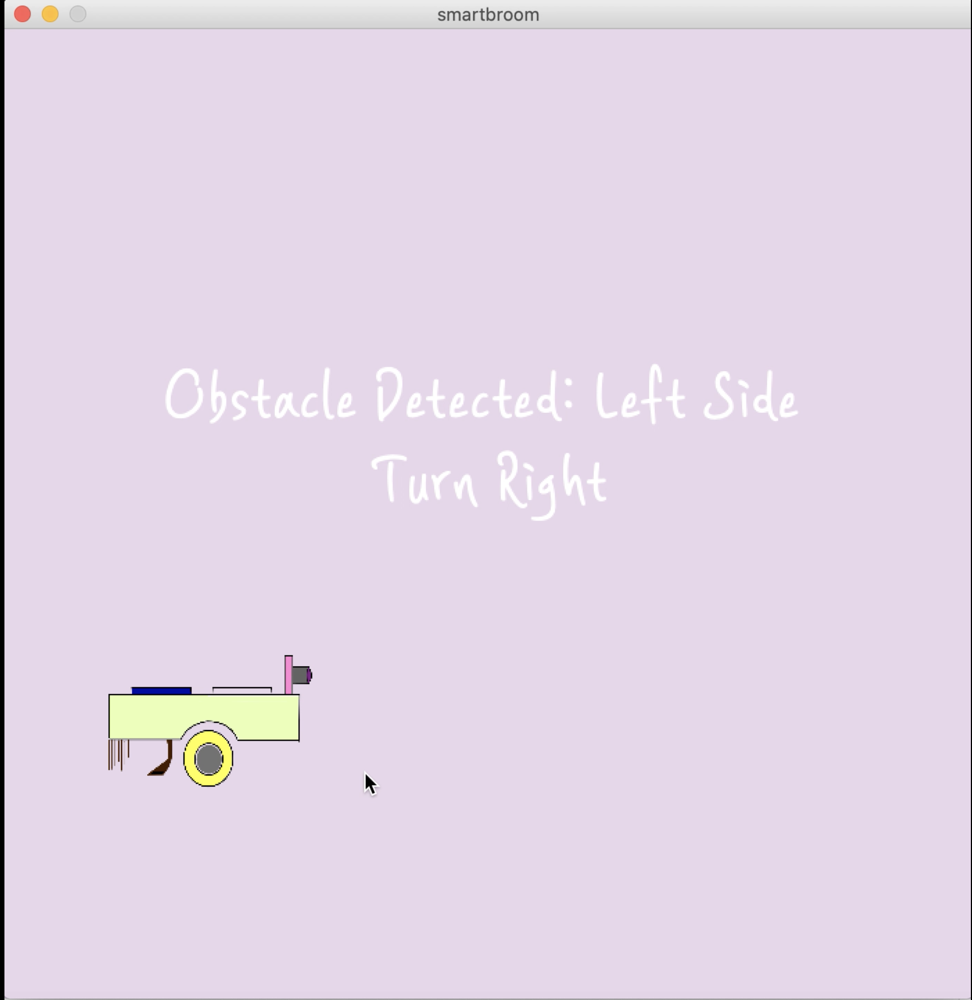

4. If the obstacle is detected from the right sight, the car will move backward and then turn left. The following screen will be shown.

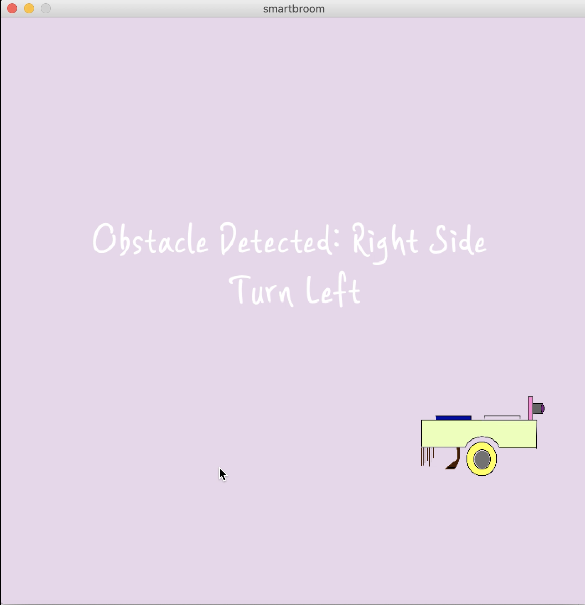

5. If you click the button on the top right "pause," the car will pause its movments and the following screen will be shown.  

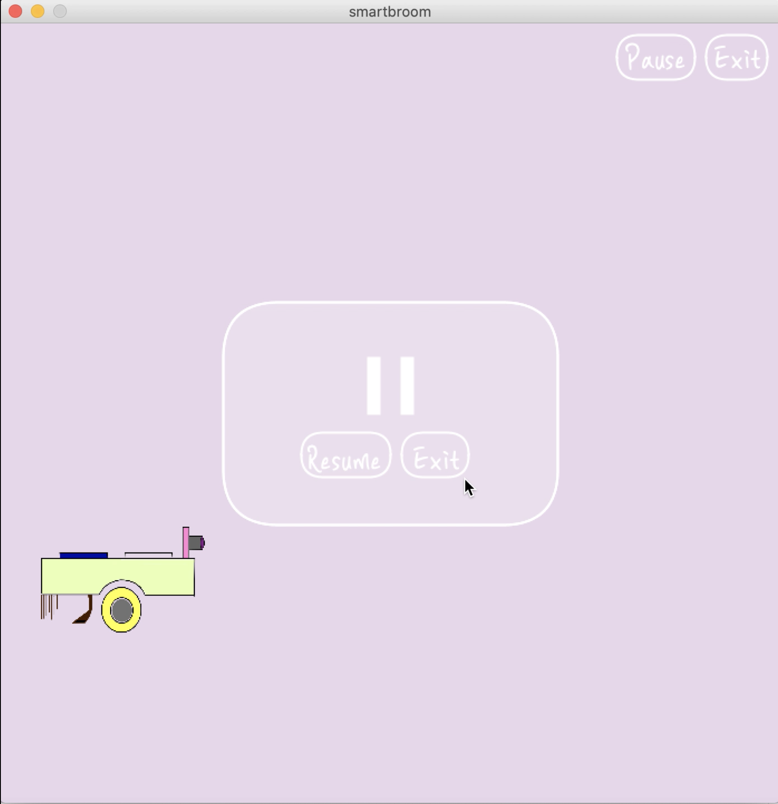

### CODE
1. Arduino 
  i) When it receives signal from the processing, it starts working. Otherwise, the speed of the wheel is set as 0. 
  ii) Three functions are made: moveForward(), moveBackward(), movePattern(). movePattern() is to move the device accordingly when the obstacle is spotted. If the obstacle is at left, turn right. Otherwise, turn left. 
  iii) Servomotor is rotating by rewriting the angle. The angle changes by 10 degree. 

2. Processing
  i) 

### Major Problems and Modifications
1. When I first created class for hammer, I loaded the image everytime the function was called to display the hammer according to the score. However, using loadImage() everytime when displaying hammer made the response of image to the movement of cursor very slow. The image followed the cursore, but it was lagging.   So, what I did was to remove the class for hammer as I only needed mouseX, mouseY for the hammer, and changed the way to load image for hammer. Instead of checking score everytime the draw() function is called, I made a condition to load new image for hammer when the current score % 20 = 0 or 5. It means that the score just went over 20, 40, 60, or 80. And these are the only times to change the speed or image of the hammer. After making modifications, the lagging time decreased and now the hammer follows the cursor pretty quickly!   
 2. At first, I just planned to make the winning condition for earning 100 points. However, when I actually created the game, it seemed dull. So, I added a timer which counts seconds it took for the user to complete the game and compare it with the best record. When you run the program and play it for the first time there is no best record yet. However, after restarting the game, the best record will be stored and the users can now compare their speed with the best record while playing the game.  To make this possible I used millis() function. I first stored the start time using millis() to the variable and subtracted it from the millis() when the   game ended. I also converted the time unit from milliseconds to seconds, and the total time taken for game to be completed in seconds would be (millis()-start_sec)/1000.

