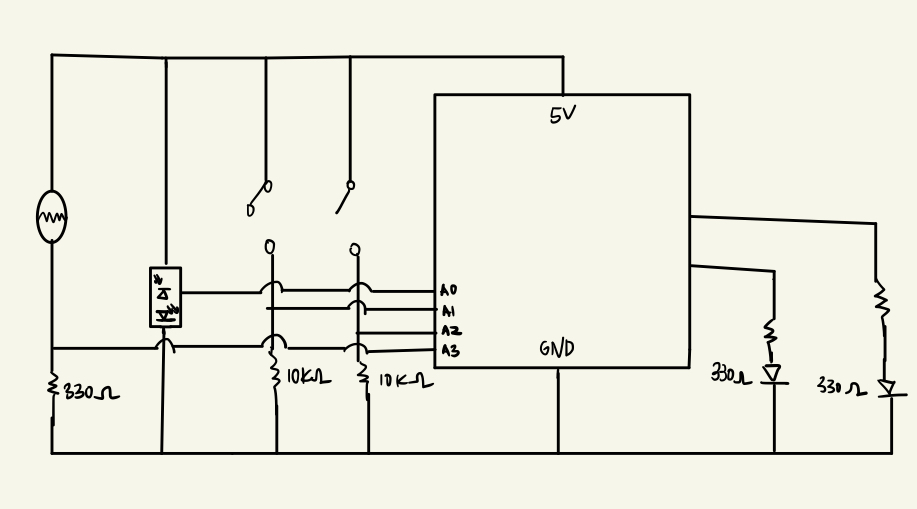

# T-rex Dinosaur Game

### April 12
The basic concept of my game is a T-rex game.  
Yes, the game that pops up on a Google page when you have problems with your internet connection.  

   

##### Interaction between Arduino and Proceesing

1. The movement of the T-rex would be controlled by the switches on the Arduino board.
2. After certain score is achieved by the player, a distance sensor can be used to make the T-rex fly for 10 seconds.
3. Every time the player gains points, the LED light will be turned on.
4. A buzzer can be added to the board to play the sounds when the score is gained. (Maybe processing itself can play more sophisticated sounds)
5. Photosensor can be used to change the brightness of the background of the game.

### Possible Images That Can Be Used

  Different Images for T-rex for Animation 
    

  Different Images for Cactus (Obstacles) 
    

### April 14
I tried to come up with the scheme. I am not sure how to draw an ultrasonic sensor in the schematic (needs update). 

  This is the scheme I planned so far. 
    

### April 16
I started making processing file first to create basic logistics for t-rex game.
I first started with displaying the ground and t-rex.

class Ground{
  float posX = width;
  float posY = height - floor(random(groundHeight - 20, groundHeight + 30));
  int w = floor(random(1, 10));
  
  Ground(){
  }
  
  void show(){
    stroke(0);
    strokeWeight(3);
    line(posX, posY, posX + w, posY);
  }
  
  void move(float speed){
    posX -= speed;
  }
}

I want to make prettier background for the game. I will bring more ideas later.

### April 21
I completed the prcessing version of the game.

  This is the scheme I planned so far. 
    

