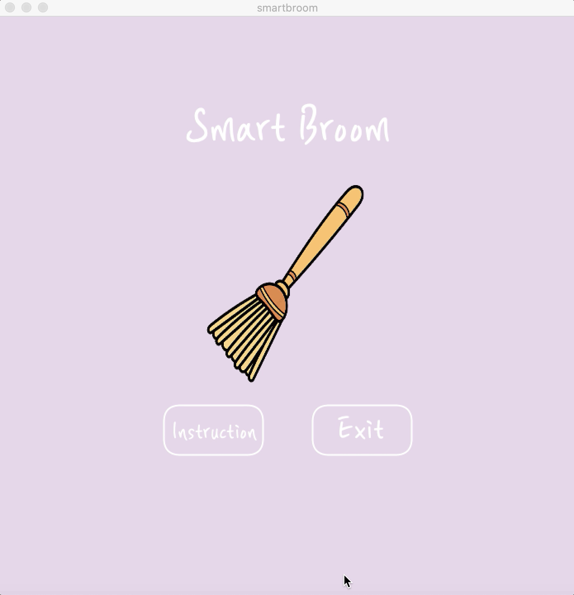
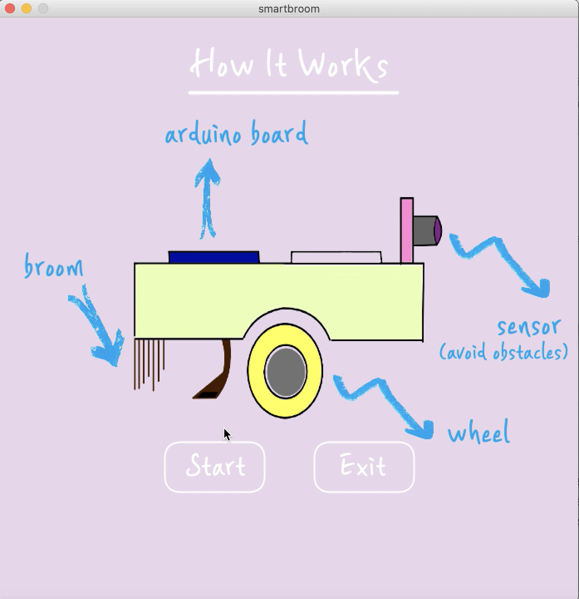
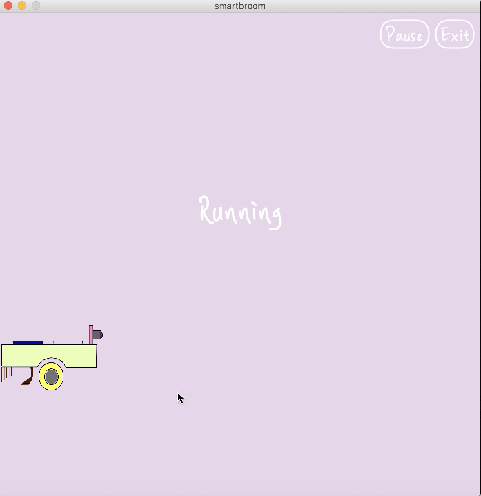

# Smart Broom

### April 20
Idea: Make the RC car with ultrasonic sensor to avoid obstacles automatically. To detect obstacles in a wide angle range, a servo motor can be used to rotate the ultrasonic sensor.

<p align="center">
  I desinged the device on iPad.<br>
  
</p>

### April 21
I drew the schematic; the Arduino board should be connected to a servo motor, an ultrasonic sensor, and two DC motors.

<p align="center">
  Schematic drawn on iPad.<br>
  
</p>

I built the first version of RC car with cardboard boxes. It failed because the sensors and motors are not fixed to the strcture. Components fall apart while the device makes movements. I should come up with another material for the structure of the vehicle.

### April 22
I built the second version of the car with the acrylic plate. Now, it is much more stable. Placing the ultrasonic sensor on top of the servo motor was the most tricky part. I ended up using glue gun to first fix the cardboard box plate with the servomotor. And then placed ultrasonic sensor using tapes and glue gum. Because of the weight of the ultrasonic sensor, the sensor kept facing down. So I added some paper to keep the balance.

<p align="center">
  This is how it looks like: <br>
  
</p>

### April 23
Wrote codes for arduino part. <br>
Three main functions needed: moveForward(), moveBackward(), movePattern().

1. moveForward()
```
void moveForward() {

  analogWrite(pwmAPin, 255);
  digitalWrite(ain1Pin, HIGH);
  digitalWrite(ain2Pin, LOW);

  analogWrite(pwmBPin, 255);
  digitalWrite(bin1Pin, HIGH);
  digitalWrite(bin2Pin, LOW);

}
```
2. moveBackward(): Reverse the HIGH/LOW pin order compared to the moveForward() function.
```
void moveBackward() { //this function codes for the car to move backward at full speed
  back = 1;
  analogWrite(pwmAPin, 255);
  digitalWrite(ain1Pin, LOW);
  digitalWrite(ain2Pin, HIGH);

  analogWrite(pwmBPin, 255);
  digitalWrite(bin1Pin, LOW);
  digitalWrite(bin2Pin, HIGH);
}
```
3. movePattern()
```
void movePattern() { //if the car detects obstacles
  moveBackward(); //move backward
  delay(500);
  if (angle >= 90) { //if the obstacle is at the right side, turn left
    analogWrite(pwmAPin, 255);  
    digitalWrite(ain1Pin, HIGH);
    digitalWrite(ain2Pin, LOW);

    analogWrite(pwmBPin, 255);
    digitalWrite(bin1Pin, LOW);
    digitalWrite(bin2Pin, HIGH);

    right = 1;
    left = 0;

    delay(500);
  }
  else {
    analogWrite(pwmAPin, 255); //if the obstacle is at the left side, turn left
    digitalWrite(ain1Pin, LOW);
    digitalWrite(ain2Pin, HIGH);

    analogWrite(pwmBPin, 255);
    digitalWrite(bin1Pin, HIGH);
    digitalWrite(bin2Pin, LOW);

    delay(500);

    left = 1;
    right = 0;
  }

  angle = 90; //change the direction the servo motor rotates
  if (state = 10) {
    state = -10;
  } else if (state = -10){
    state = 10;
  }
  myservo.write(angle);
  delay(100);
}
```
### April 24
The sensor keeps detecting obstacles even though there is nothing in front of it. I tried to organize wires behind it and it worked better. But, it needed more improvement. I decided to decrease the range of angle the servo motor rotates to make ultrasonic sensor not detect a bunch of wires at the side.
```
if (angle == 140) state = -10;
        else if (angle == 40) state = 10;
        angle += state;
        delay(100);
```

I also wored on the processing to make the first two screens. For the start screen, I added instructions and exit buttons. For the instructions page, same buttons were made.

1. Start Screen <br> 
<p align="center">
  This is how it looks like: <br>
  
</p>
2. Instructions Screen <br> 
  <p align="center">
  This is how it looks like: <br>
  
</p>

### April 26
I worked on the main screen to show whether the device is moving forward or changing its direction due to obstacles. 
1. When there is no obstacle
<p align="center">
  This is how it looks like: <br>
  
</p>
2. When there is an obstacle at left
<p align="center">
  This is how it looks like: <br>
  
</p>
3. When there is an obstacle at right
<p align="center">
  This is how it looks like: <br>
  
</p>

### April 27
I had hard time making proper interactions between arduino and processing. Depending on where I put the Serial.print() function in the arduino program, it was writing the wrong values. So I tried to put these lines every here and there and found the place it sends the proper value!

Also, when the processing reads and store those values, it took some time for me to figure out why the changes in movements are not reflected on the screen. 
