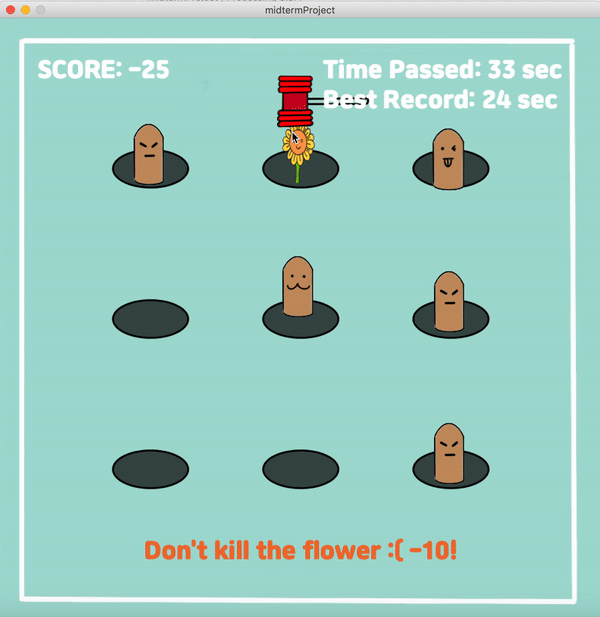
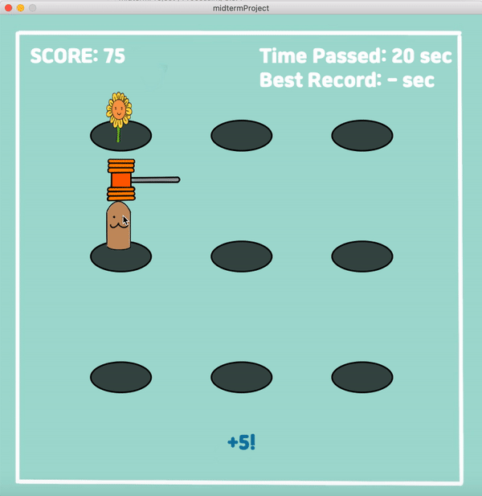

# WHACK-A-MOLE
Moles randomly pop up among 9 holes! Try to hit the mole with a hammer by clicking them and earn points!

### Motivation
I decided to create this game since I had good memories playing whack-a-mole with the machin in the streets with my friends. By making a digitalized version of the game, I thought I could add my taste through color choices, images of mole, etc. It means a lot to me to recreate this game, which is one of my favorite childhood memories. 

  This is how the whack-a-mole game machine looks like:  
  

### Instruction
I created this game based on classic rules of the original game. But I added different types of moles, which will give you different score when hitting them. Also, if you hit the flower, you will lose 10 points.

Simply, you win by reaching 100 points. You lose if the score reaches -30!

  Below is the picture for detailed instruction:  
  

### How Does It Look Like
1. If you start running the program, you will be able to see the start screen with two buttons: instruction and start.
Just click the instruction button to see the instruction or click the start button to start the game. 

  
  

2. Once you start the game, the moles and flower will randomly appear among 9 holes. There are total 5 different types of moles and 1 type of flower. The images will be randomly chosen.  
  

  
  
  
  
   
  

3. The hammer will follow your mouse and you will be able to hit the moles or flowers by clicking them with a hammer. If you click the objects, the score will be updated according to what you clicked. 

  If you hit the mole with a hat:  
    
  If you hit the mole without a hat:  
    
  If you hit the flower:  
    

  
3. The game will get faster as you earn more points. Every 20 points you earned, the mole will move upward faster, and also the color of the hammer changes.

  
  
  
  
  

4. If you reach -30 points by hitting the flower repeatedly, you will lose the game and the game will stop. The endscreen will be displayed, on which you can click the buttons to restart the game or quit. 

  

If you earn 100 points by hitting the flower repeatedly, you will win the game and the game will stop. The endscreen will be displayed, on which you can click the buttons to restart the game or quit. On the endscreen, the time taken for you to reach 100 points will be shown, along with the best score. 

  

