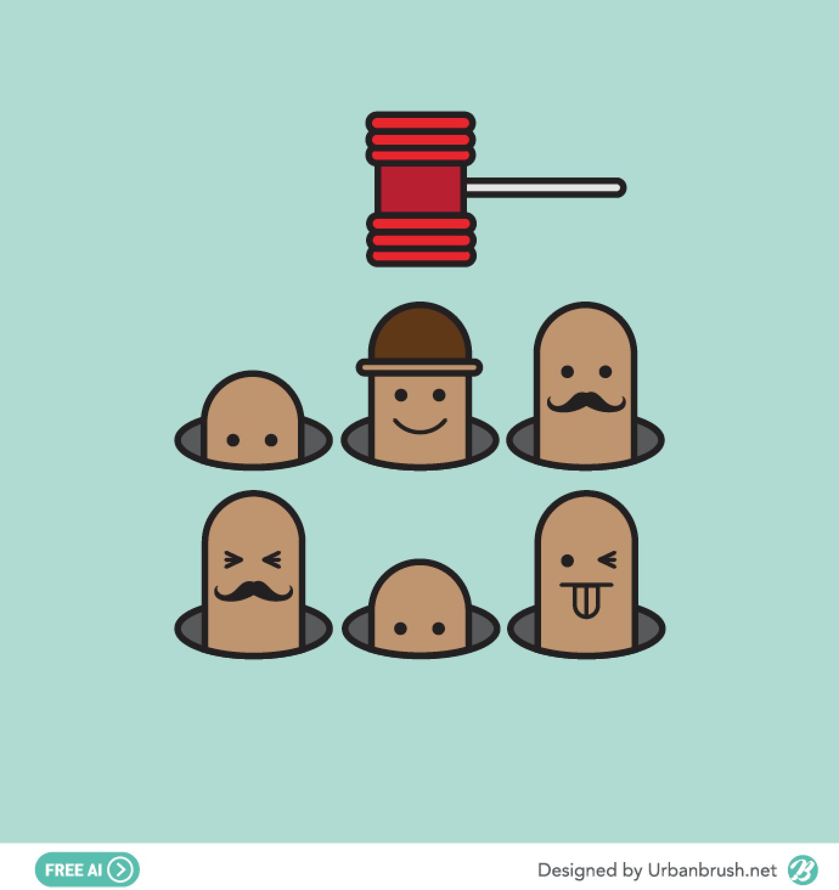
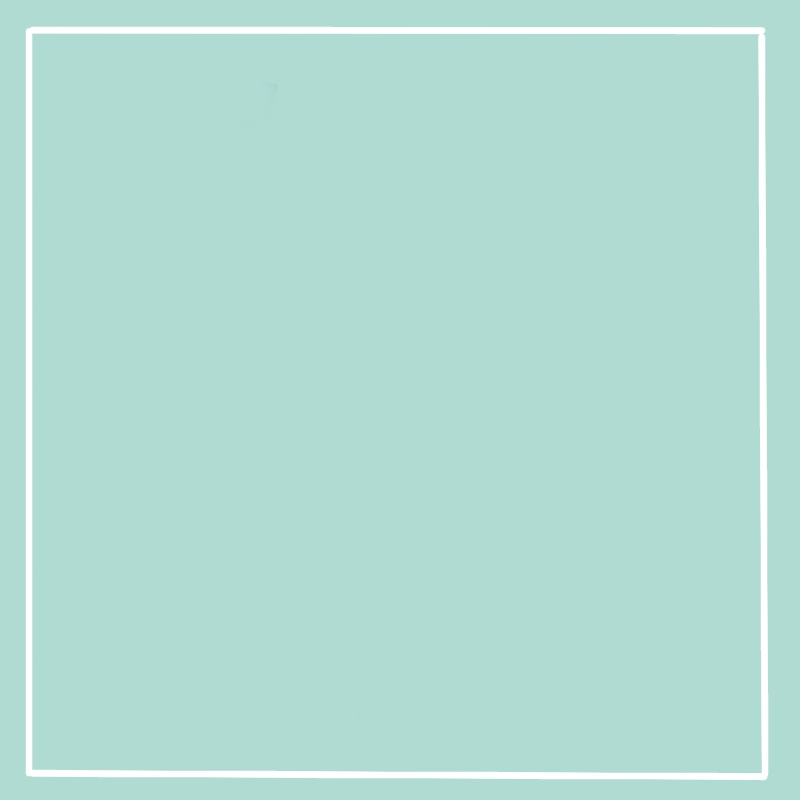
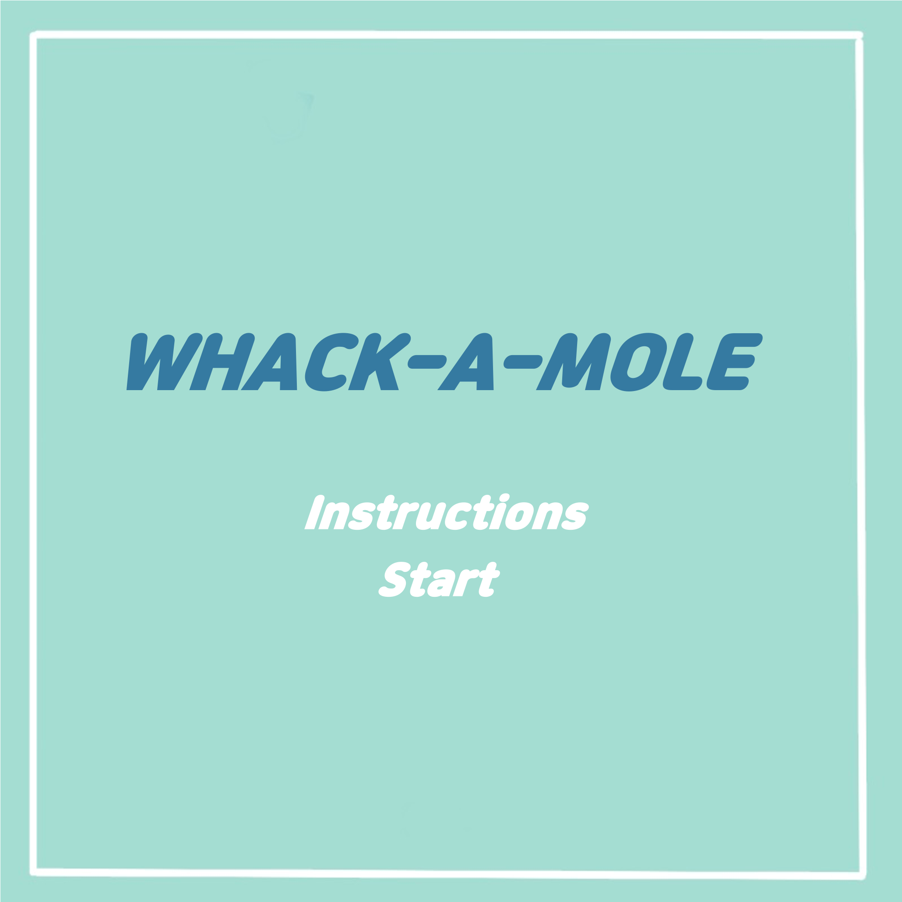
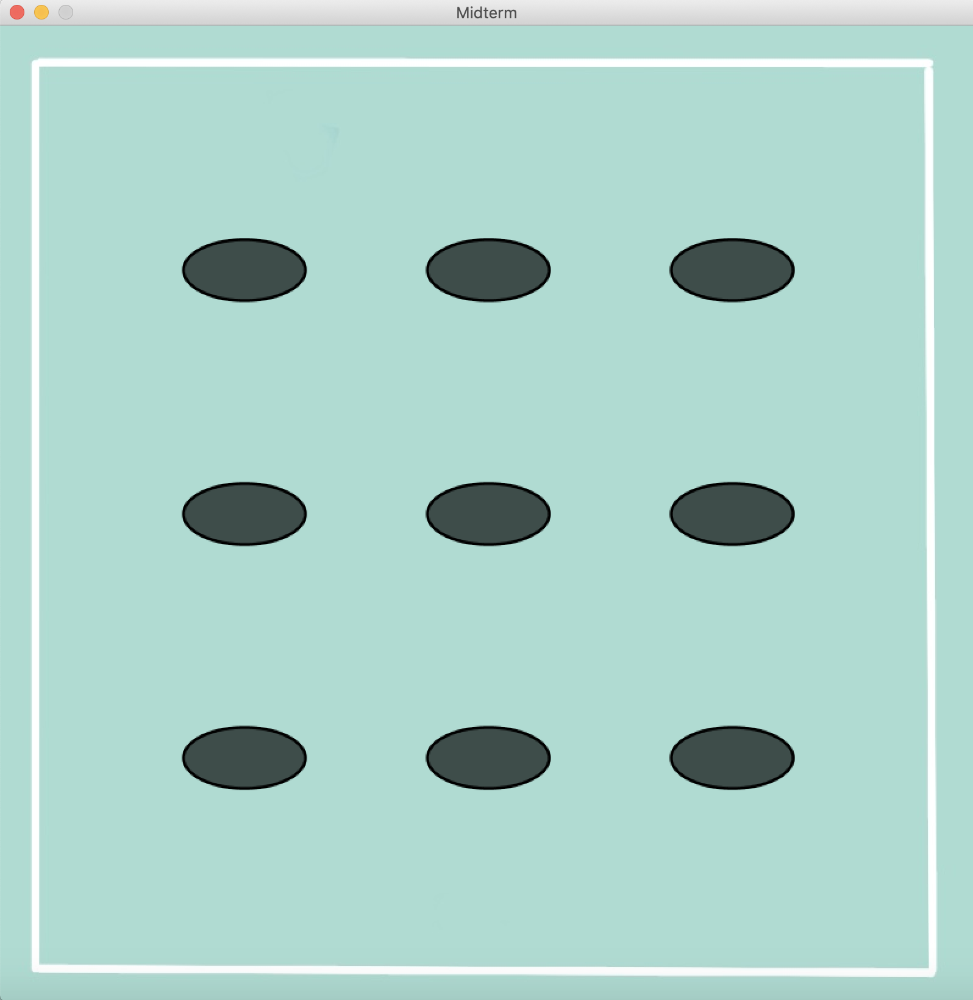
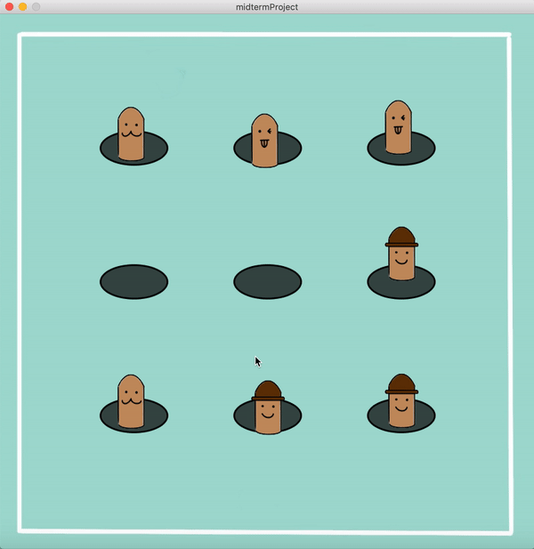
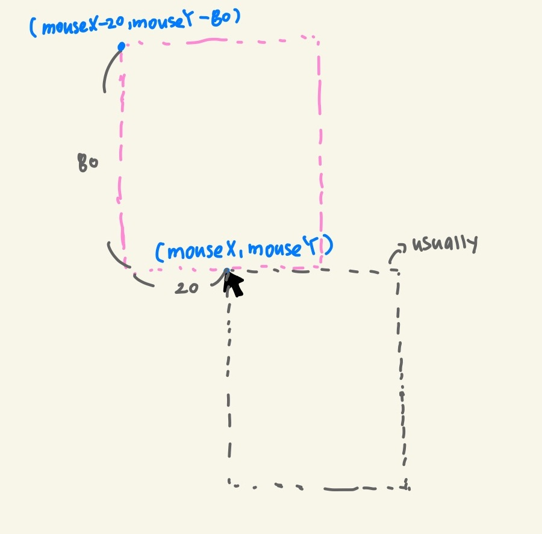
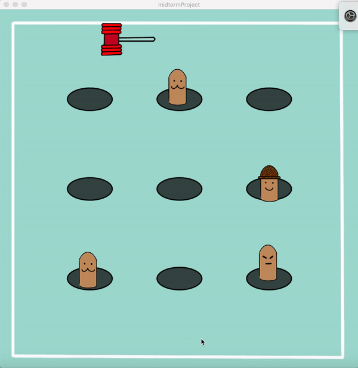
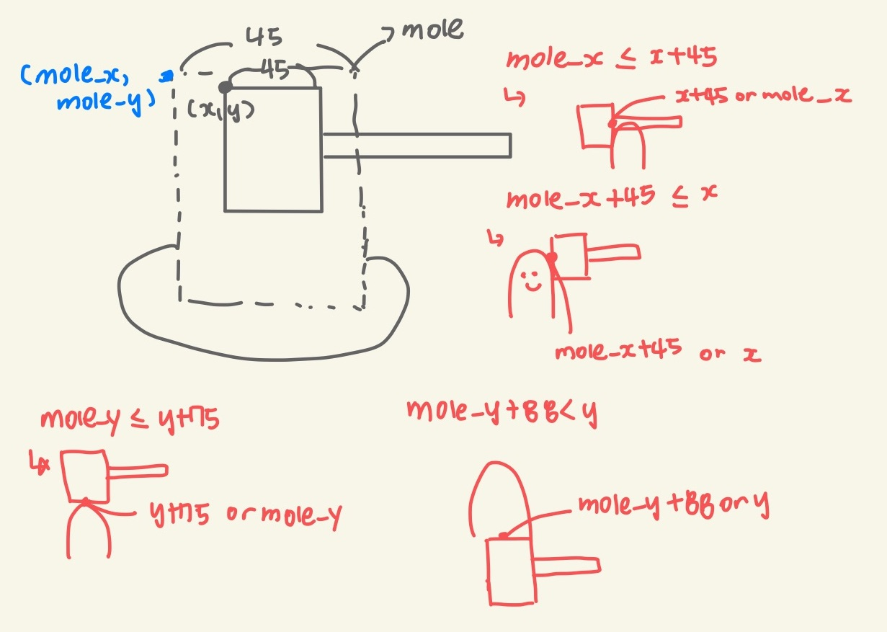

# WHACK-A-MOLE

### February 18, 2021 : Brainstorm ###
I plant to make a game "Whack-a-mole," where moles randomly pop up in the screen and the user need to hit the mole with a hammer.

##### Possible Ideas #####
1. The user will earn 5 points every time the hit each mole and 10 points for hitting the mole with a hat on.
2. The user will lose 10 points if they hit a flower with a hammer.
3. The speed of the game will be faster as the user reaches higher points.
4. The design of a hammer will get more sophisticated every ten points gained.
5. Reaching 99 points total, the user wins!

##### Research #####
I looked up various illustrations and images for whack-a-mole and chose one image that I liked the most. I will refer to this image for desgining the game.
<p align="center">
  Model Illustration can be found here:
  https://www.urbanbrush.net<br>
  
</p>

### February 20, 2021 : Create Images Needed ###
I created the images needed for the start screen and the instructions. Referring the model illustration, I used RGB picker website (https://imagecolorpicker.com/en) to find out the color codes used for the illustration.

##### Background #####
The background image I created (using Procreate on ipad):
<p align="center">
  
</p>

##### Start Screen #####
The start screen I created (using Powerpoint to insert the text):
<p align="center">
  
</p>

##### Instruction Screen #####
The Instruction screen I created (using Powerpoint to insert the text):
<p align="center">
  
</p>

##### Images for Moles #####
The images of moles I created (using Procreate on ipad):
<p align="center">
  
  
  
  
  
</p>

### February 21, 2021 : Display Images and Create Buttons ###
##### Display Images #####
I created a function for displaying images for the first few screens. It first loads the first screen and when the user clicks the "Instruction" or "Start" button, the screen changes. To check whether the buttom in clicked and control the action, I created boolean variables btn_start and btn_inst.
```
void start_display() {
  int x=mouseX; 
  int y=mouseY;

  PImage img_start;  
  img_start=loadImage("img/start.png");

  PImage img_inst;
  img_inst=loadImage("img/instruction.png");

  if (btn_inst == false && btn_start == false) {
    image(img_start, 0, 0, 800, 800);
    if (mousePressed) {
      if (x>=260 && x<=530 && y>=400 && y<=480) {
        btn_inst=true;
      };
      if (mouseX>=325 && mouseX<=455 && mouseY>=490 && mouseY<=560) {
        btn_start=true;
      };
    };
  };

  if (btn_inst==true) {
    image(img_inst, 0, 0, 800, 800);
    //rect(350, 680, 100, 80);

    if (mousePressed) {
      if (x>=350 && x<=450 && y>=680 && y<=760) {
        btn_inst=false;
      };
    };
  };
};
```
This is how the button works:
<p align="center">
  
</p>

### February 22, 2021 : Create Classes for Moles and Display Moles ###
After the user clicks the start button, the screen changes to the game screen. I first created a function called createMoles() in order to create an array of class for moles and assign its position using for loop.
```
Mole[] moles = new Mole[9];
void createMoles(Mole[] array) {
  int x_pos=200; 
  int y_pos=200;

  for (int i=0; i<9; i++) {
    array[i]=new Mole(x_pos, y_pos, i);
    if (i%3!=2) {
      x_pos+=200;
    } else {
      y_pos+=200;
      x_pos=200;
    }
  };
};
```
I also created a class of moles called "Mole." The class Mole has various attributes including coordinates of the mole, index (numbering), coordinates of its hole, boolean variable for its visibility, etc.
```
  int hole_x, hole_y, hole_cnt;
  PImage img_mole;
  String img_nm;
  int mole_num;
  int mole_x, mole_y;
  int time_cnt=int(random(1,6));
  ```
 Under the class Moles, I made a function to display hole. It simply draws the ellipse on the coordinates stored by the variable hole_x and hole_y.
 ```
 void hole_display() {
    if (btn_start==true) {
      stroke(0, 0, 0);
      strokeWeight(2.5);
      fill(0, 0, 0, 165);
      ellipse(hole_x, hole_y, 100, 50);
    };
  };
  ```
 This is the result:
<p align="center">
  
</p>

Then, I created another function to display moles. By picking random number from 1 to 5, it choosed the type of mole randomly. Since all the moles should not appear at the same time, I also randomly assigned the value for boolean variable visiblity. Therefore, the type of the mole, the visibility of the mole is randomly chosen.
```
mole_num=int(random(1, 6));
img_nm="img/mole"+str(mole_num)+".png";
img_mole=loadImage(img_nm);

int visible=int(random(2));

void mole_display() {
  if (visible==1) {
    image(img_mole, mole_x, mole_y);
    };
  };

```
To make the moles move, I made an mole_update() function where the y-coordinate of mole moves upward. If it reaches an upperlimit, then the function resets all the information for the mole. At first, when I made this function it all had the motion at the same time. To make it more dynamic I added the variable called time_cnt and assignmed the value randomly to make each mole is in diffferent phase of the movement. 
```
int time_cnt=int(random(1,6));

void mole_update() {
    mole_y-=10;
    time_cnt+=1;

    if (time_cnt>=5) {
      moles[hole_cnt]=new Mole(hole_x, hole_y, hole_cnt);
    };
  };
};
```
 This is the result:
<p align="center">
  
</p>

### February 24, 2021 : Add Flower ###
I added a flower image as one type of mole. I increased the range of choosing random number by 1 when constructing a class for mole, so that when initiating the game, it can be randomly chosen whether the hole will be having moles or flowers. I drew the images for a flower using Procreate on iPad.

<p align="center">
  
</p>


### February 25, 2021 : Display Hammer ###
First, I drew the images for hammer with different colors using Procreate on iPad.
<p align="center">
  
  
  
  
  
</p>
Now, I tried to display hammer along my mouse. However, to reduce the confusion for the user where to hit the moles, I wanted to display the image of hammer upward to the cursor so that the cursor is placed at the midpoint of bottom line of the hammer image. I added the line of function image() to draw hammer. I first constructed a class for hammer; however, the object was lagging and the response to the movements of cursor was slow. So, to reduce the complexity of the code and make it less bulky, I commented out the class for hammer.<br>

```
image(img_hm, mouseX-20, mouseY-80, 125, 75);
```

<p align="center">
  
</p>

Instead, there is a function called hammer_change(). This function is only called when the score % 20 equals 0 or 5. When the function goes over 20,40,60,80 points, the color of hammer changes by displaying different image file.

```
void hammer_change() {
  if (score<20) {
    img_nm="img/hammer1.png";
    y_change=2;
    phase=int(50/y_change);
  } else if (score<40) {
    img_nm="img/hammer2.png";
    y_change=2.4;
    phase=int(50/y_change);
  } else if (score<60) {
    img_nm="img/hammer3.png";
    y_change=2.8;
    phase=int(50/y_change);
  } else if (score<80) {
    img_nm="img/hammer4.png";
    y_change=3.2;
    phase=int(50/y_change);
  } else if (score<100) {
    img_nm="img/hammer5.png";
    y_change=3.6;
    phase=int(50/y_change);
  }
  img_hm=loadImage(img_nm);
  hit=false;
};
```

This is the result:
<p align="center">
  
</p>

### February 27, 2021 : Check Collisions ###
I added the global variable int score and then updated the score whenever the hammer hit the mole. In order to check the range for the collisions I sketched the image again for easier calculations.

<p align="center">
  
</p>

```
void mole_hit() {
    int x=mouseX-20; 
    int y=mouseY-80;

    if (x+45>mole_x && x<mole_x+45 && y+75>mole_y && y<mole_y+88 && mousePressed && visible==1) {
      hit=true;

      if (score%20==0 || score%20==5) {
        hammer_change();
      };
      start_fc=frameCount;
      if (mole_num==4) {
        score+=10;
        score_change=10;

      } else if (mole_num==6) {
        score-=10;
        score_change=-10;

        //text("Don't kill the flower :( -10!", width/2,720);
      } else {
        score+=5;
        score_change=5;
      }
      moles[hole_cnt]=new Mole(hole_x, hole_y, hole_cnt);
    }
  };
  ```
  The function above checks if the collision happened and update the score accordingly.
  
  
